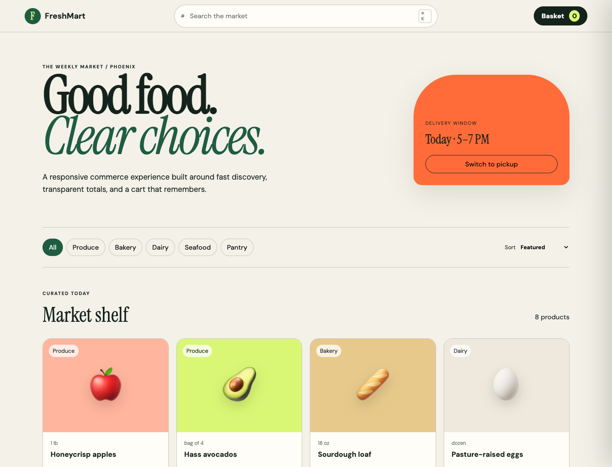

# FreshMart Commerce

An accessible, responsive grocery storefront evolved from my original FreshMart browser prototype. The portfolio edition focuses on clean state management, testable commerce rules, keyboard support, and a fast interface with no runtime dependencies.



## 1. Product overview

FreshMart lets shoppers search and filter a curated catalog, choose fulfillment mode, manage persistent cart quantities, apply a demonstration promotion, and review transparent totals.

## 2. Original-work lineage

This repository is a structured evolution of my earlier single-file FreshMart project. The catalog and cart concept are retained; architecture, accessibility, testing, documentation, and visual design were expanded for portfolio presentation.

## 3. User experience

The visual system uses an editorial market aesthetic rather than a generic dashboard. Desktop and mobile layouts preserve product discoverability and make the basket reachable without losing catalog context.

## 4. Capabilities

- Search, category filters, and four sort modes
- Persistent cart with quantity controls
- Delivery/pickup state and transparent tax calculation
- Demonstration `FRESH10` promotion
- Keyboard shortcut, Escape handling, focus return, and live announcements

## 5. Architecture

Pure catalog and pricing rules live in `assets/core.js`; browser behavior lives in `assets/app.js`. See [architecture notes](docs/ARCHITECTURE.md).

## 6. Technology

Semantic HTML, modern CSS, vanilla JavaScript, localStorage, Node's built-in test runner, Chrome headless screenshots, and GitHub Actions.

## 7. Performance approach

The project has no application dependencies or framework runtime. Motion is limited to compositor-friendly transform/opacity changes. Actual frame rate depends on the browser and device; the UI does not claim a universal 120 FPS guarantee.

## 8. Accessibility

Keyboard behavior, semantic structure, live status messages, reduced motion, and labeled quantity controls are documented in [ACCESSIBILITY.md](docs/ACCESSIBILITY.md).

## 9. Quick start

```bash
python3 -m http.server 4173
# open http://localhost:4173
```

## 10. Testing

```bash
node --test tests/*.test.cjs
```

Tests cover search/category filtering, stable sorting, and discount-before-tax totals.

## 11. Automated screenshots

```bash
./scripts/capture_screenshots.sh
```

Desktop and mobile captures are written to `docs/screenshots/`.

## 12. Repository map

```text
assets/        styles, UI controller, testable rules
docs/          architecture, accessibility, interview notes, screenshots
scripts/       repeatable visual capture
tests/         Node unit tests
index.html     accessible application shell
```

## 13. Data and privacy

Cart state stays in the browser. There are no trackers, accounts, payment calls, or remote product APIs.

## 14. Security boundary

This is a frontend demonstration. Production totals, promotions, prices, inventory, and payments must be verified by a trusted server.

## 15. Browser support

The interface targets current Chrome, Edge, Firefox, and Safari. It degrades to standard scrolling and controls when backdrop filtering is unavailable.

## 16. Interview discussion

The [interview guide](docs/INTERVIEW_GUIDE.md) explains architectural decisions, trade-offs, and credible production next steps.

## 17. Roadmap

- API-backed inventory and cart validation
- Product detail routes and optimistic updates
- Automated accessibility and browser tests
- Authenticated saved lists and order history

## 18. License

[MIT](LICENSE)
